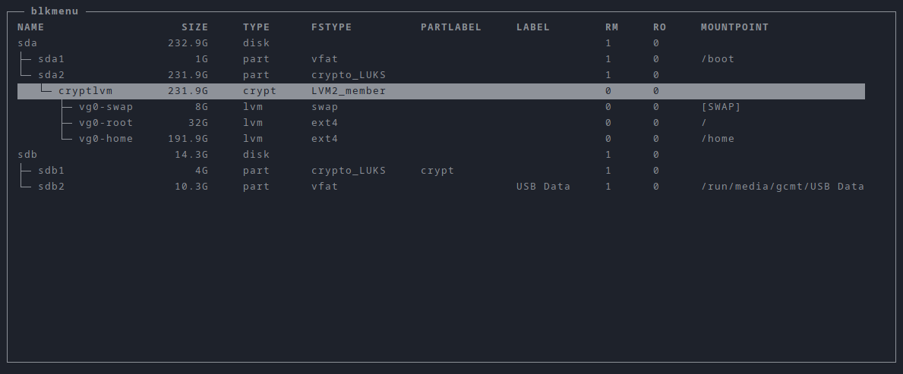

blkmenu
=======

Tiny curses wrapper around _lsblk_ and _udisksctl_.



Installation
------------

Arch users can simply run the following command from the project directory

```
makepkg -si
```

Anyone else can install the program with `pip`

```
pip install --user blkmenu
```

Or by running the following commands from the project directory

```
install -Dm755 blkmenu "$HOME/.local/bin/blkmenu"
install -Dm644 blkmenu.1 "$HOME/.local/share/man/man1/blkmenu.1"
```

Usage
-----

Type `?` once you start `blkmenu` for a quick overview of all predefined key bindings.

An overview of all command line options can be found [here](blkmenu.adoc) or by running `man blkmenu`.

Run `blkmenu --help` for a quick help.

License
-------

See [LICENSE.txt](LICENSE.txt).
